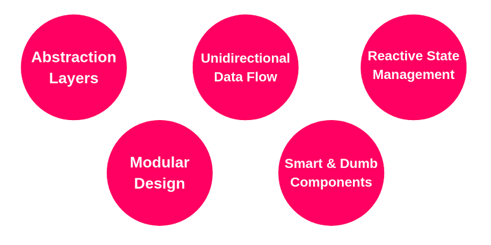
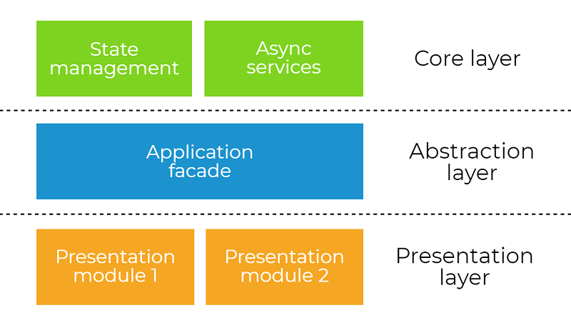
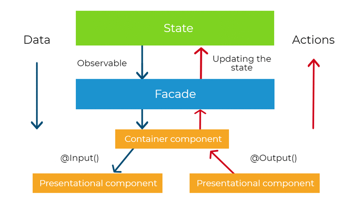
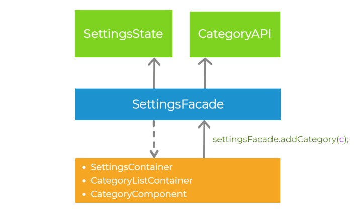

[Reference 1: angular-architecture-best-practices](https://angular-academy.com/angular-architecture-best-practices/)

# Bullets
Our ultimate goal in this article is to learn how to design Angular application in order to maintain sustainable development speed and ease of adding new features in the long run. To achieve these goals, we will apply:

- proper abstractions between application layers
- unidirectional data flow
- reactive state management
- modular design
- smart and dumb components pattern

# My Rule
Rule 1: generate component with it's module
Rule 2:  

# High-level abstraction layers (Core Layer | Abstraction Layer | Presentation Layer)

- each module have these folder: 
  Cores (Apis + States) | Facades (guards + resolvers + services) | Views (modules)
- each module have these file:
  moduleName.module.ts | moduleName-routing.module.ts
- each views have it child module that can work with the application

| Module Folder                     | Child Folder                       |
| ----------------------------------| ---------------------------------- | 
| Cores                             |  Apis + States                     |
| Facades                           |  Utils  + Guards + Resolvers       |  
| Views                             |  Child Modules                     |

# Unidirectional data flow

It means that a child component can only depend on its parent and never vice versa. This is why we call it unidirectional data flow. This allows Angular to traverse the components tree only once.

This gives us the important system’s property mentioned before - data consistency - and the state object becomes the single source of truth.

# Reactive state management

Whenever there is a need to change the state, it can happen only by calling a method on the state object (or dispatching an action in case of using NgRx). Then, the change is propagated “down”, via streams, the to presentation layer (or any other service). This way, our state management is reactive.

First, let’s imagine that there is some event in the presentation layer (for example button click). The component delegates the execution to the abstraction layer, calling the method on the facade settingsFacade.addCategory(). Then, the facade calls the methods on the services in the core layer - categoryApi.create() and settingsState.addCategory(). The order of invocation of those two methods depends on synchronization strategy we choose (pessimistic or optimistic). Finally, the application state is propagated down to the presentation layer via the observable streams. This process is well-defined.

# Modular Design

Here's our logo (hover to see the title text):

| Module List                       | Explains
| ----------------------------------| ---------------------------------- | 
| Core Module                       |  imported only once                |
| Shared Module                     |  imported by any feature module    |  
| Views Module                      |  import shared module              |  

# Smart and dumb components
- Smart Components (aka Containers). These components usually:
  - have facade/s and other services injected,
  - communicate with the core layer,
  - pass data to the dumb components,
  - react to the events from dumb components,
  - are top-level routable components (but not always!). 

- Dumb Components: 
  - Their only responsibilities are to present UI element and to delegate user interaction “up” to the smart components via events
  - That element does not have any particular logic implemented
  
## For Dumb Components

| Module File                      | Explain                             |
| ----------------------------------| ---------------------------------- | 
| moduleName.module.ts              |                                    |
| componentName.container.ts        |                                    |  
| componentName.container.csss      |                                    |  
| componentName.container.html      |                                    |  

## For Dumb Components

| Module File                      | Explain                             |
| ----------------------------------| ---------------------------------- | 
| moduleName.module.ts              |                                    |
| componentName.component.ts        |                                    |  
| componentName.component.csss      |                                    |  
| componentName.component.html      |                                    |  
